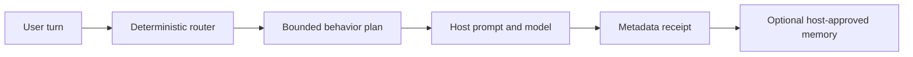

# Humanlike Agent Kit

**Deterministic, provider-neutral behavior controls for conversational AI agents.**

[English](#english) · [Русский](#русский) · [Documentation](#documentation) · [License](#license)

> **Status: public beta (`0.1.1`), licensed under MIT.** The API and configuration schema may change before `1.0`. The core runtime is offline, uses only the Python standard library, and does not call an LLM or the network.



## English

Humanlike Agent Kit is a behavioral planning layer for AI agents. It classifies each turn, selects a social and cognitive mode, assembles bounded guidance, and returns privacy-aware metadata. The host remains responsible for model calls, tools, transport, output delivery, transcript retention, and policy enforcement.

### What it provides

- Deterministic RU/EN routing across cognitive modes and social moves.
- Bounded context plans with mandatory truth and privacy guidance.
- Persona anchoring, repetition control, calibrated stance, and drift signals.
- Optional evidence-aware SQLite memory behind explicit host-controlled consent.
- A 40-case offline conformance suite for routing, privacy, context budgets, policy, disclosure, stance, memory, and drift.
- A reference Hermes directory plugin with `pre_llm_call`, `transform_llm_output`, `post_llm_call`, and `on_session_finalize` hooks.
- Stable JSON CLI commands: `route`, `doctor`, and `eval`.

### What it is not

Humanlike Agent Kit is not a model, chatbot UI, autonomous agent host, network service, or complete model-safety system. It does not make an AI biologically human, hide AI identity, or control data already copied into a host or provider transcript.

### Quickstart

Requirements: Git and Python 3.11 or newer. The hardened profile loader and SQLite memory backend require a local POSIX filesystem; native Windows is not supported for those components in `0.1.x`.

```bash
git clone https://github.com/AlekseiUL/humanlike-agent-kit.git
cd humanlike-agent-kit
python3 -m venv .venv
source .venv/bin/activate
python -m pip install .
```

Run the first deterministic route:

```bash
humanlike route --text "Rewrite this paragraph in a neutral tone." --locale en
```

Run the bundled offline conformance suite:

```bash
humanlike eval
```

Validate the included Hermes reference profile:

```bash
humanlike doctor --config examples/hermes-humanlike/humanlike.toml
```

Each command prints one JSON object. Exit status `0` means success; validation errors use exit status `2`; `humanlike eval` uses exit status `1` when a declared expectation fails.

### Python API

```python
from pathlib import Path

from humanlike_agent import HumanlikeRuntime, Persona, RuntimeConfig, TurnInput

profile = Path("examples/hermes-humanlike").resolve()
persona = Persona.load(profile / "SOUL.md", allowed_root=profile)
runtime = HumanlikeRuntime(RuntimeConfig("example-profile"), persona)

plan = runtime.prepare(
    TurnInput(
        text="Give me three distinct approaches.",
        turn_id="turn-1",
        session_id="session-1",
        locale="en",
    )
)
print(plan.render_context())
```

The host calls its model and reports bounded outcome metadata through `runtime.observe(...)`. See [Architecture](docs/ARCHITECTURE.md) for the full lifecycle and trust boundary.

### Hermes integration

Install the package into Hermes' own Python environment, validate it, and then enable its official plugin entry point. Pin a reviewed commit in production:

```bash
HERMES_PYTHON="$(dirname "$(command -v hermes)")/python"
uv pip install --python "$HERMES_PYTHON" \
  "git+https://github.com/AlekseiUL/humanlike-agent-kit.git@<40-character-commit-sha>"
hermes plugins enable humanlike-agent-kit --no-allow-tool-override
hermes plugins show humanlike-agent-kit
```

Start a new Hermes session after enabling it. The full source tree contains adversarial safety fixtures, so direct directory-plugin installation is intentionally not used. See [Hermes installation](docs/HERMES_INSTALL.md) for details, health checks, rollback, and removal. Compatibility is documented in [Compatibility](docs/COMPATIBILITY.md).

Memory is disabled by default. Enabling it requires `memory_enabled = true`, `acknowledge_host_context_persistence = true`, and a relative `state_path`. The runtime cannot delete copies already retained by a host or model provider.

### Development

```bash
uv sync --locked --all-extras
uv run pytest -q
uv run ruff check .
uv run python scripts/privacy_gate.py .
```

The installed runtime has no third-party Python dependencies. Development, build, CI, and integration references are documented in [Acknowledgements](ACKNOWLEDGEMENTS.md).

---

## Русский

Humanlike Agent Kit — публичная бета-библиотека под лицензией MIT. Это детерминированный поведенческий слой для ИИ-агентов: он определяет тип запроса и способ ответа, собирает ограниченный контекст и возвращает метаданные с учётом приватности. Вызов модели, инструменты, доставка ответа, хранение переписки и соблюдение политик остаются на стороне основной системы.

### Что умеет

- Маршрутизирует русские и английские запросы без вызова модели.
- Формирует ограниченный план ответа с правилами честности и приватности.
- Удерживает персону, снижает повторы, отслеживает позицию и поведенческий дрейф.
- Поддерживает опциональную SQLite-память только с явным согласием основной системы.
- Запускает офлайн-проверку из 40 кейсов.
- Даёт эталонный адаптер для Hermes и JSON CLI-команды `route`, `doctor`, `eval`.

### Чего не делает

Это не модель, не интерфейс чата, не автономный агент и не универсальный фильтр безопасности. Kit не скрывает природу ИИ и не может удалить данные, которые уже сохранил хост или провайдер модели.

### Быстрый старт

Нужны Git и Python 3.11 или новее. Для защищённой загрузки профиля и SQLite-памяти требуется локальная POSIX-файловая система; нативный Windows для этих компонентов в ветке `0.1.x` не поддерживается.

```bash
git clone https://github.com/AlekseiUL/humanlike-agent-kit.git
cd humanlike-agent-kit
python3 -m venv .venv
source .venv/bin/activate
python -m pip install .
```

Проверка одного запроса:

```bash
humanlike route --text "Перепиши этот абзац нейтрально." --locale ru
```

Офлайн-тесты поведения:

```bash
humanlike eval
```

Проверка примера профиля Hermes:

```bash
humanlike doctor --config examples/hermes-humanlike/humanlike.toml
```

Каждая команда печатает один JSON-объект. Код завершения `0` означает успех, `2` — ошибку входных данных или конфигурации, а `humanlike eval` возвращает `1`, если хотя бы одна заявленная проверка не пройдена.

### Интеграция и память

Установите пакет в рабочую Python-среду Hermes, проверьте его и затем включите официальную точку подключения. Для рабочего использования закрепите проверенный коммит:

```bash
HERMES_PYTHON="$(dirname "$(command -v hermes)")/python"
uv pip install --python "$HERMES_PYTHON" \
  "git+https://github.com/AlekseiUL/humanlike-agent-kit.git@<40-character-commit-sha>"
hermes plugins enable humanlike-agent-kit --no-allow-tool-override
hermes plugins show humanlike-agent-kit
```

После включения начните новую сессию Hermes. В исходниках есть провокационные данные для тестов безопасности, поэтому прямая установка всего репозитория как directory-плагина намеренно не используется. Проверка, откат и удаление описаны в [инструкции по установке](docs/HERMES_INSTALL.md).

Память по умолчанию выключена. Для включения нужны `memory_enabled = true`, `acknowledge_host_context_persistence = true` и относительный `state_path`. Это осознанное ограничение: библиотека не управляет копиями данных в основной системе или у провайдера модели.

## Documentation

- [Architecture / Архитектура](docs/ARCHITECTURE.md)
- [Privacy / Приватность](docs/PRIVACY.md)
- [Compatibility / Совместимость](docs/COMPATIBILITY.md)
- [Hermes installation / Установка в Hermes](docs/HERMES_INSTALL.md)
- [Threat model / Модель угроз](docs/THREAT_MODEL.md)
- [Security policy](SECURITY.md)
- [Contributing](CONTRIBUTING.md)
- [Acknowledgements and third-party tooling](ACKNOWLEDGEMENTS.md)
- [Changelog](CHANGELOG.md)

## Author and community

Created by **Aleksei Ulyanov**.

- [YouTube](https://youtube.com/@alekseiulianov)
- [Telegram: Sprut AI](https://t.me/Sprut_AI)
- [Telegram community chat](https://t.me/+eH-qNIDmud8zNDZi)
- [AI Операционка](https://t.me/tribute/app?startapp=sJyg)

## License

Humanlike Agent Kit is released under the [MIT License](LICENSE). The bundled foundation pack is included under the same MIT terms. External tools and projects referenced during development are listed in [ACKNOWLEDGEMENTS.md](ACKNOWLEDGEMENTS.md); their own licenses continue to apply.
